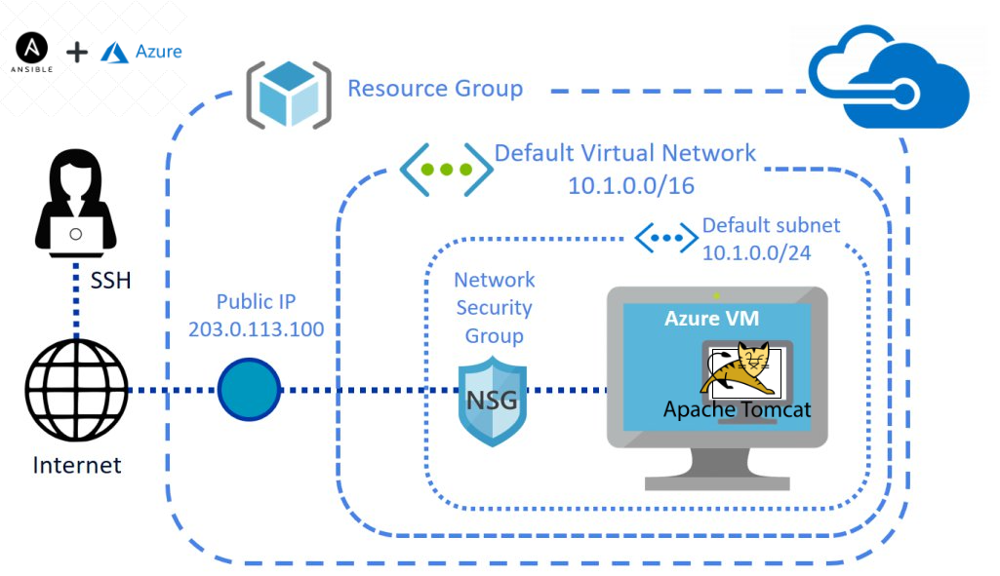

# Azure Cloud Cloud Infrastructure Auomtation 
### - by Pranav Sharma, Principal Solutions Architect - DevOps Consulting
Ansible Playbook Module structure that configures VM Instances on MicroSoft Azure Cloud with below automation features 

## Architecture
### UseCase - Provisioning+Compliance+Automation+Orchrestration+Apps Deployment
 

### Following are the current feature set for a VM Provisioning
1. Creating Resource group infrastructure on Azure Cloud
2. Creating required Virtual Network and Subnets for VMs
3. Creating Network Security Groups with required port allow/deny rules
4. Creating a VM with redundnacy rules
5. Creating Storage account and disk resource set
6. Creating Attaching Public Gateway to VM 
7. Creating Cloud RSA-SSH keys to access VM from on-premise
8. Adding Firewall rules to OS Firewalld  Security Group
9. Creating a OS Image with required Users and Passwords 
8. Reserving & Attaching Public IP for Extenal Access to VM
9. Providing a Summary of Instance provisioned at the end
10. Dynamically capturing ID's for VPC,Subnet,Public Gateway, Instance ID, NIC id ,SG id etc.. into one file.


### Following are the current feature set for a Apache Tomat WebApp deployment
1. Gathers Ansible facts
2. Downloads and set EPEL repository , Add firewall rules for Tomcat as per OS type
3. Installs dependency packages
4. Performs environmental pre and post-checks
5. Installs Java libraries and deploys Apache Tomcat server framework
6. Adds System User and group for Tomcat
7. Use of Notifiers for service handlers , adds required ports for WebApps access
8. Downloads, Extracts and Symlinks Tomcat directory
9. Changes ownership, Configure tomcat parameters and starts the service
10. Deploys a Interactive Scheduler Calendar Application on Apache Tomcat server instance

## Getting Started

Pre-requisites:
1. Ansible v2.9 or later installed
2. Azure Cloud API or CLI Key Credentials embedded to system
## Preparations

1. Create a Ansible Creds file in `~/.azure/credentials` following below format:
```
[default]
subscription_id=<your-subscription_id>
client_id=<security-principal-appid>
secret=<security-principal-password>
tenant=<security-principal-tenant>
```
```
## Running the Installation

```
#git clone https://github.com/pranav-sharma429/Azure_vm_provisioning.git
```

